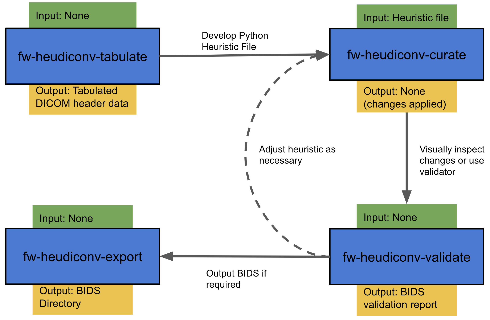

BIDS & FlywheelTools Explained
==================================

FlywheelTools consists of two tools — ``fw-heudiconv`` and ``flaudit``.

Flywheel HeuDiConv (``fw-heudiconv``) is based on the popular ``heudiconv`` software,
"flexible DICOM converter for organizing brain imaging data into structured
directory layouts" [`source <https://heudiconv.readthedocs.io/en/latest/>`_]. Like ``heudiconv``,
``fw-heudiconv`` makes use of a user-defined **heuristic** — a discrete set of rules —
to standardise naming conventions within the user's project directory into BIDS.
This is particularly useful in Flywheel, where curation, pre-processing, and
analyses are all automated in the context of BIDS.

BIDS stands for Brain Imaging Directory Structure, and is a standard format for
organizing and storing brain imaging data. It's an organisational standard
that makes it easy to share, collaborate on, and analyse your data. Among many other details,
BIDS prioritizes having imaging scans located in a nested directory structure,
where the top level is the subject label, followed by the imaging session label,
followed by the modality of measurement. Each imaging file (typically NIfTI
format) must have an associated `.json` dictionary, known as a sidecar, that
stores the image's metadata. Additionally, filenames must adhere to a
``{key}-{value}.{extension}`` naming convention, where key-value pairs are
separated by underscores `_`. This makes files very easy to parse by eye, hand, or machine,
and if a BIDS dataset is valid, it can be used as seamless input into a myriad of
BIDS-ready processing and analysis pipelines, officially called BIDS apps.

The goal of ``fw-heudiconv`` is to provide researchers with a tool to flexibly and reproducibly
curate their Flywheel datasets into BIDS, that is as powerful as it is easy to use.

When you're done, you can use ``flaudit`` to audit your data and make sure
everything went as planned. ``flaudit`` is a containerized gear on Flywheel that
loops over the data in your project, and collects data about the sequences that
exist in the project, if and how they were curated into BIDS, and if analysis
gears were run on them. One important feature is the inclusion of a
`template subject`. When specified, ``flaudit`` will use that subject's data as
a gold standard and compare each other subject to them, highlighting:

- If the subject has collected the same scanning sequences as the template
- If the subject has been curated into BIDS identically to the template
- If the subject has run the same analysis gears as the template. This comparison
is sensitive to gear versions, so you can be sure your subjects ran the same
version of algorithms as the template.

The output of the gear is an HTML report that can be opened in your web browser,
as well as the accompanying CSVs that generated it, in case you want to explore
the data further.

General Workflow
----------------

In ``fw-heudiconv``, the general workflow is as follows:

1. Extract DICOM header information from your data with the ``tabulate`` tool
2. Craft a heuristic that can:
   a) create BIDS-valid filenames, paths, and metadata
   b) parse the DICOMs to decide which NIfTIs are assigned to which BIDS names
3. Test & apply these changes on Flywheel with the ``curate`` tool
4. Adjust the heuristic as necessary and repeat testing and application
5. Validate and/or export your BIDS-valid data (``validate`` or ``export`` tools)

The workflow is illustrated below:

This workflow can also be accomplished on Flywheel through the GUI without the
need for command line tools. Each of the tools is documented in the next section.
