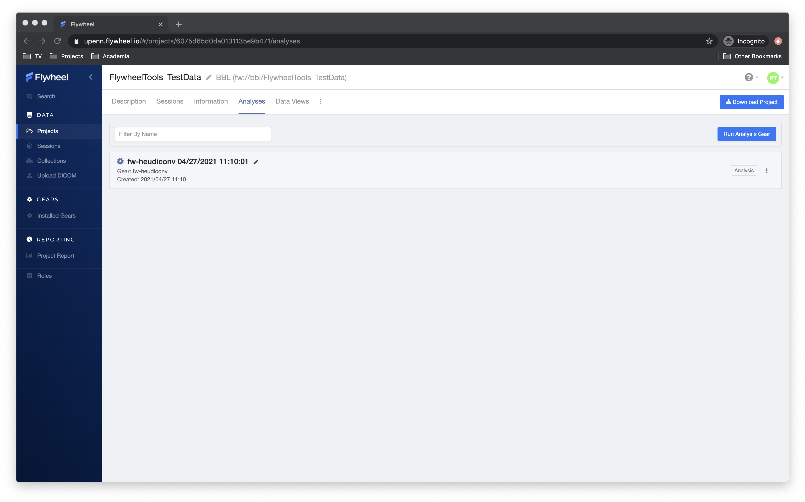
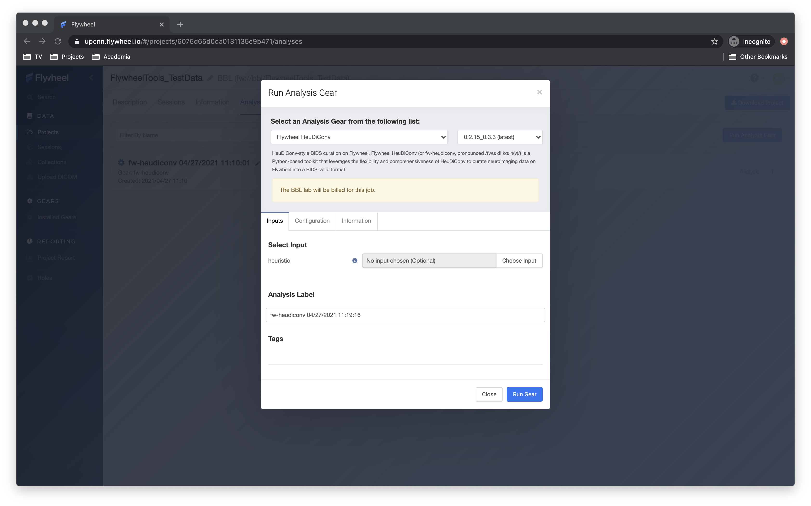
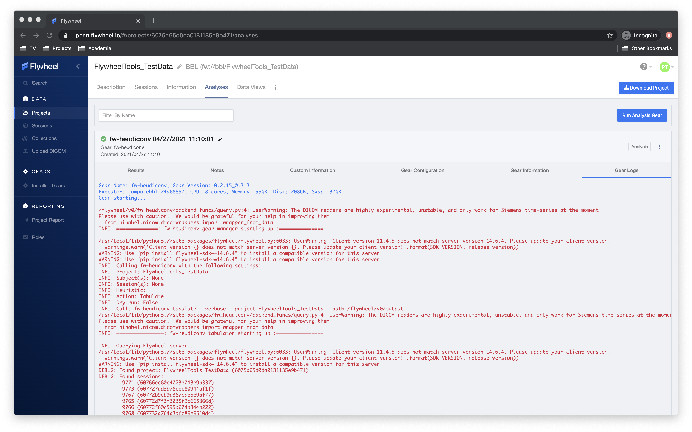
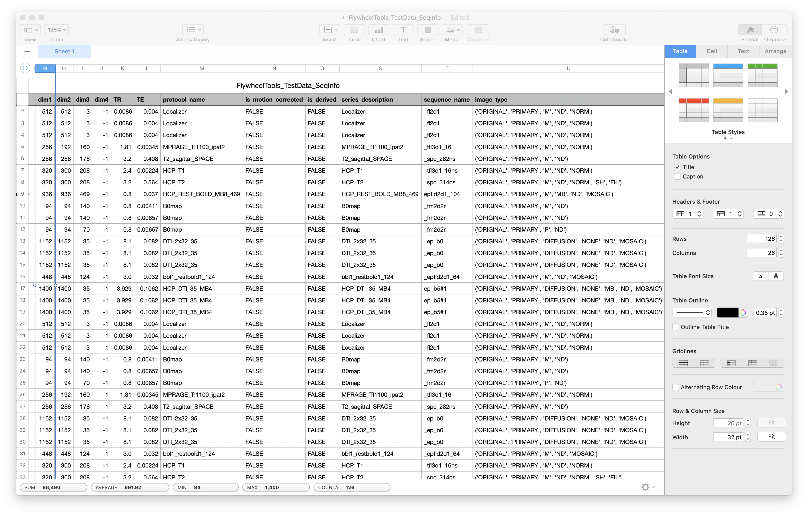
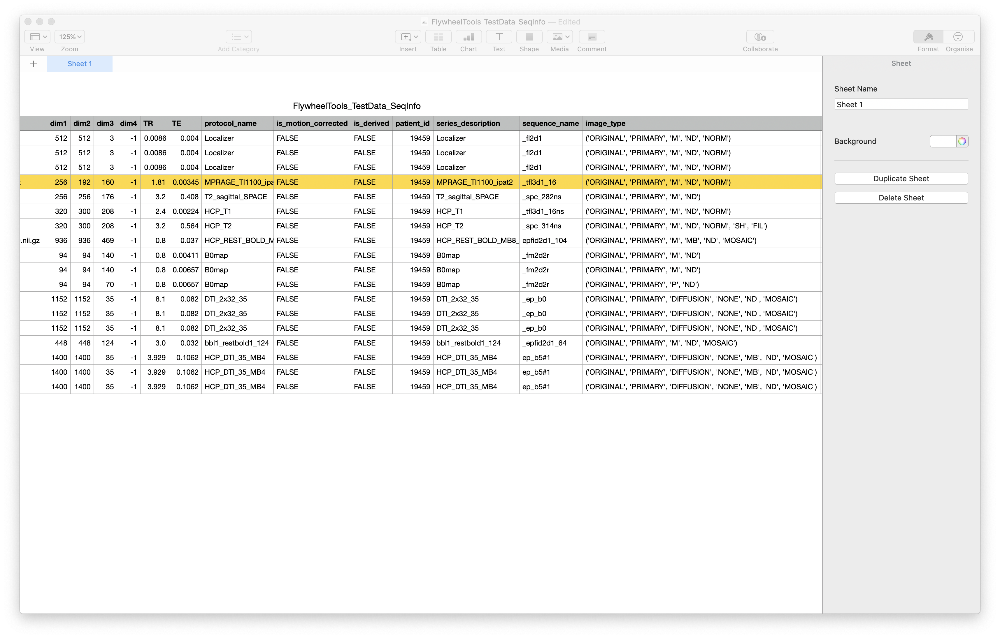
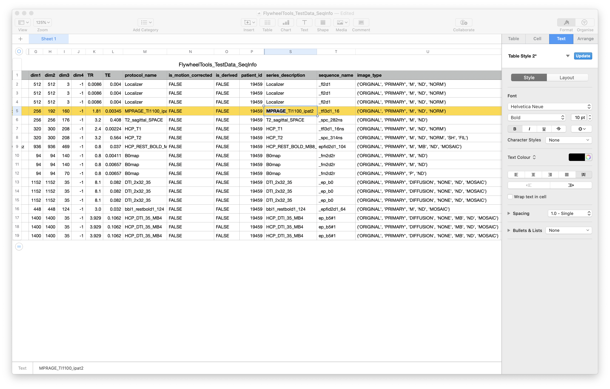
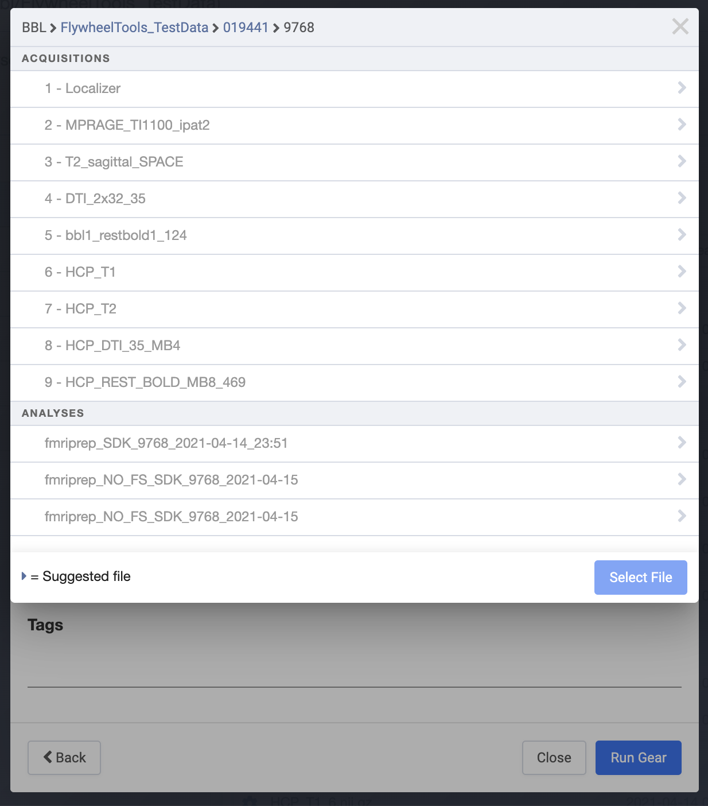
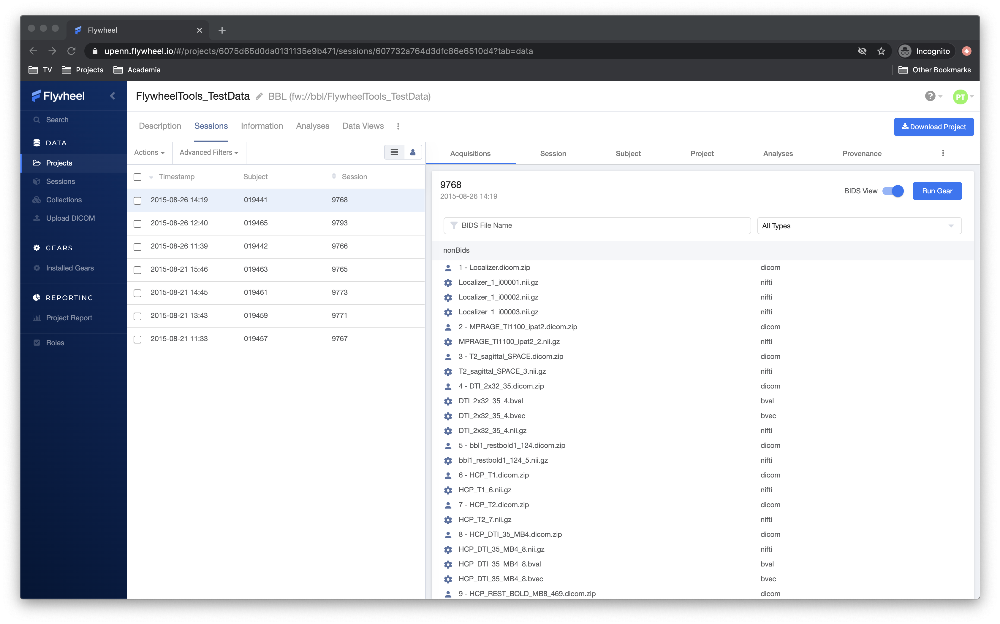

.. _stepbystep:

Step-By-Step Guide
====================
Let's walk through an example of how to curate some simple data on Flywheel. For
this tutorial, you will at the very least need access to Flywheel and a text editor.

Step 1: Understanding Your Dataset in the Context of BIDS
---------------------------------------------------------

Before you can curate the dataset into BIDS, it's important to be able to
predict how your dataset should look in BIDS. If you don't know what BIDS is,
check the official `readthedocs <https://bids-specification.readthedocs.io/en/stable/>`_.

Our goal here will be to map DICOMs to NIfTIs named correctly in BIDS,
including the directory structure, correct metadata sidecars, and fieldmap files:

.. image:: dicom-reorganization-transparent-white_1000x477.png
   :width: 600

To start, we need to figure out what we can use to create this "mapping". In
``fw-heudiconv`` curation, this mapping is called a heuristic, and we'll use
the DICOMs' header information to create rules for this mapping. To extract this
information, we will use ``fw-heudiconv-tabulate`` to generate a `seqinfo table`.

``fw-heudiconv-tabulate``
-------------------------

In the Flywheel GUI, navigate to your project, and select the "Analysis" tab:

Click the "Run Analysis Gear" button, which will drop down the analysis box. In
this box, select ``Flywheel HeuDiConv`` as the gear to run the analysis.

From here, click the "Configuration" tab (there are no inputs required at
this stage). This will allow you to set the configuration for the gear. Under
"Action", select "Tabulate", and make sure to *uncheck* ``dry_run``. When ready,
hit "Run Gear"!

The same can be accomplished at the command line, with this command:

.. code-block:: python

    fw-heudiconv-tabulate --project FlywheelTools_TestData --path MY/OUTPUT/DIRECTORY/

The Output
^^^^^^^^^^

You should now see an analysis object appear in the GUI. This analysis object is
associated with the project, since we started it at the project level. If a blue
gear is spinning, the gear is still running (this can include virtual machine
initialization and shut down time); a red X means it failed, but a green check
means success! You should be able to check the "Gear Logs" in the analysis object
to read through ``stdout`` (all the commands and outputs) as the gear ran.

In the Results section of the analysis, Flywheel zips all the data it was
instructed to save as outputs -- in this case, the result of our tabulation.
Download this file and unzip it, afterwhich you can open it in your table viewer
or text editor of choice.

Next, we're going to use this table to curate one of the subjects. Fortunately,
in the table viewer, we can use a filter to only show data from one subject.
Here, we pick subject 019465 using the ``patient_id`` column.

Developing a Simple Heuristic
-----------------------------

To start, open up any text editor, such as Notepad or TextEdit. We're going to
start by curating the anatomical T1w image, whose DICOM is highlighted here:

In-depth knowledge of these functions is not necessary for this tutorial, but
see :ref:`heuristic` if you want to understand each of them in earnest. First,
copy and paste the ``create_key()`` function into a new file in your text editor:

.. code-block:: python

    def create_key(template, outtype=('nii.gz',), annotation_classes=None):
        if template is None or not template:
            raise ValueError('Template must be a valid format string')
        return template, outtype, annotation_classes

Next, use this function to create a BIDS name for the T1w NIfTI you want:

.. code-block:: python

    def create_key(template, outtype=('nii.gz',), annotation_classes=None):
        if template is None or not template:
            raise ValueError('Template must be a valid format string')
        return template, outtype, annotation_classes

    # Create Keys
    t1w = create_key(
       'sub-{subject}/ses-{session}/anat/sub-{subject}_ses-{session}_T1w')

When ``fw-heudiconv`` runs this heuristic, there will exist a variable called
``t1w``, and it will have the string specifying the BIDS file name and path
for a T1w (relative to the BIDS root). The next step is making sure that the
DICOM we selected will be assigned to this variable. The next function we will
use to do that is the ``infotodict`` function:

.. code-block:: python

    def infotodict(seqinfo):

        info = {
          t1w: []
        }

        for s in seqinfo:
            if "MPRAGE" in s.series_description:
                info[t1w].append(s.series_id)

        return info

After the function is defined with ``def``, we create the ``info`` object -- a
Python dictionary with one key, ``t1w``, and an empty list. Our goal is to
populate this dictionary with the list of DICOMs who belong to the ``t1w`` key.

The input to this function, ``seqinfo``, is `each row from your seqinfo table`.
So looping over the object ``seqinfo`` gives you access to each row of your table,
where the variables in the table are accessed using Python.

In our example above, we access ``series_description`` and use Python logic to
check if it contains the
string ``MPRAGE``. We know our T1w is the only one that has this string:

So we `append` the ``series_id`` value of that row (the unique identifier of
the DICOM) to the list of files that should be named this way -- the ``t1w`` key.
The heuristic at this point should look like this:

.. code-block:: python

    def create_key(template, outtype=('nii.gz',), annotation_classes=None):
        if template is None or not template:
            raise ValueError('Template must be a valid format string')
        return template, outtype, annotation_classes

    # Create Keys
    t1w = create_key(
       'sub-{subject}/ses-{session}/anat/sub-{subject}_ses-{session}_T1w')

    # loop over the seqinfo table
    def infotodict(seqinfo):

        # the dictionary of keys and list of files they correspond to
        info = {
          t1w: []
        }

        # loop over each row of your seqinfo table
        for s in seqinfo:

            # if the series description contains "MPRAGE",
            # add the DICOM identifier to the dictionary

            if "MPRAGE" in s.series_description:
                info[t1w].append(s.series_id)

            # a print line to tell us T1w was not found
            print("This seqinfo is not the MPRAGE:", s.series_description)
        return info

.. note::
   A good habit for debugging is to print out the ``seqinfo`` rows that did not meet
   any tests and haven't been assigned to a key

Save this file as ``my_test_heuristic.py`` -- we're going to use it in the next
section to curate the T1w image!

Curating The First Image with ``fw-heudiconv``
----------------------------------------------

The first step to curating the data is to upload this file to the Flywheel
project. Although files can be attached to any object, we recommend attaching
this to the project so that all other projects can access it easily.

In the Flywheel GUI, access the "Information" tab of the project, and upload
your heuristic file using the "Upload Attachment" button:

.. image:: upload_attachment.png
   :width: 1200

Now, we're going to launch a gear on a `single session`. Pick a session from
the subject we've been developing on (019465 -- in this case, the session is
9793). Gears run from the session level by default, though it is possible to
launch them from a subject.

In the top right, click "Run Gear". As before, a dropdown should appear for you
to select the ``Flywheel HeuDiConv`` gear from the `Analysis Gears` list. This
time, though, select an input — in the `heuristic` input box, click "Select
Input". Here' you'll be presented with a drop down to let you pick `which object`
to look for input files. The hierarchy at the top  shows that it's looking at
the current session and acquisitions:

Instead of this, click the `Project label` to select files attached to your
project, and select your heuristic. In the "Configuration" tab, select "Curate"
under the "action" option. You can leave the "dry_run" box checked -- we will
uncheck it after this test run.

When you're ready, hit "Run Gear"! Take note of the analysis' name to refer back
to  later.

To monitor progress of the gear, click on the session’s “Provenance” tab. A
grey pause symbol indicates that the job is queued, a blue cog indicates that
it is running, and a green check or red triangle indicates that the gear has
finished, successfully or unsuccessfully, respectively; refresh the page to
update the status of running gears.

At the command line, this achieved with the following command:

.. code-block:: python

    fw-heudiconv-curate --project FlywheelTools_TestData --heuristic PATH/TO/DIRECTORY/my_test_heuristic.py --subject 019465 --session 9793

The Output
^^^^^^^^^^

Next you can navigate to the output of the gear to see what happened. From within
the session, click on either the "Analysis" (for strictly any analysis gears
that have run) or "Provenance" (for a listing of `any` kind of gear that has
operated on the session) and navigate to your recent ``fw-heudiconv`` analysis.
From here, select "View Log".

First, there are virtual machine instructions, stuff Flywheel uses to let us
know what kind of virtual machine the gear ran in. Then, we have initialization
instructions from ``fw-heudiconv``'s "gear manager":

.. code-block:: python

    Gear Name: fw-heudiconv, Gear Version: 0.2.15_0.3.3
    Executor: computebbl-31f3d27f, CPU: 8 cores, Memory: 55GB, Disk: 208GB, Swap: 32GB
    Gear starting...

    INFO: ==============: fw-heudiconv gear manager starting up :===============

    INFO: Calling fw-heudiconv with the following settings:
    INFO: Project: FlywheelTools_TestData
    INFO: Subject(s): ['019465']
    INFO: Session(s): ['9793']
    INFO: Heuristic: /flywheel/v0/input/heuristic/my_test_heuristic.py
    INFO: Action: Curate
    INFO: Dry run: True
    INFO: Call: fw-heudiconv-curate --verbose --project FlywheelTools_TestData --dry-run --subject 019465 --session 9793 --heuristic /flywheel/v0/input/heuristic/my_test_heuristic.py
    INFO: =================: fw-heudiconv curator starting up :=================

Pay attention to the ``Call`` directive; this prints the command line equivalent
of what is running in the gear.

Next, the actual ``fw-heudiconv`` outputs. We see that ``fw-heudiconv`` first
attempts to load your heuristic and then
lists out all of your ``seqinfo`` objects (the rows from the table in the first part)
with the ``series_description`` first, followed by other columns:

.. code-block:: python

    INFO: Loading heuristic file...
    INFO: Heuristic loaded successfully!
    INFO: Querying Flywheel server...
    DEBUG: Found project: FlywheelTools_TestData (6075d65d0da0131135e9b471)
    DEBUG: Found sessions:
    	9793 (607732a764d3dfc86e6510d4)
    INFO: Applying heuristic to 9793 (1/1)...
    DEBUG: Found SeqInfos:
    Localizer:
    		[TR=0.0086 TE=0.004 shape=(512, 512, 3, -1) image_type=('ORIGINAL', 'PRIMARY', 'M', 'ND', 'NORM')] (607732a75b936738e644aee8)
    MPRAGE_TI1100_ipat2:
  		  [TR=1.81 TE=0.00345 shape=(256, 192, 160, -1) image_type=('ORIGINAL', 'PRIMARY', 'M', 'ND', 'NORM')] (607732a8b9d367cae5e9b0c5)
    :
    :
    :

This is good, as we can confirm the table data with the ``seqinfo`` object the tool
is using to curate your data. For example, we know there's a DICOM with the
series description ``MPRAGE_TI1100_ipat2``, and we searched specifically for the
string ``MPRAGE``. So, did we catch this ``seqinfo``?

.. code-block:: python

    HCP_REST_BOLD_MB8_469:
      [TR=0.8 TE=0.037 shape=(936, 936, 469, -1) image_type=('ORIGINAL', 'PRIMARY', 'M', 'MB', 'ND', 'MOSAIC')] (607732a864d3dfc86e6510d7)

    DEBUG:
    MPRAGE_TI1100_ipat2_2.nii.gz
    	sub-019465_ses-9793_T1w.nii.gz -> sub-019465/ses-9793/anat/sub-019465_ses-9793_T1w.nii.gz
    INFO: Done!
    INFO: ===================: Exiting fw-heudiconv curator :===================

Excellent! Now we know that the NIfTI from this DICOM, MPRAGE_TI1100_ipat2_2.nii.gz,
will be mapped to a file named ``sub-019465_ses-9793_T1w.nii.gz``, and the path
is listed there too. Additionally, we get printouts of the ``seqinfo`` objects
that didn't get caught by our logic.

To see our BIDS data before curation, go to the session view and click the "BIDS View"
toggle; there should be no BIDS data:

Now that we know it works, we can run it again with the "dry_run" box unchecked
to apply the changes. The only difference should be that the log lets you know
the changes are being applied:

.. code-block:: python

    HCP_REST_BOLD_MB8_469:
      [TR=0.8 TE=0.037 shape=(936, 936, 469, -1) image_type=('ORIGINAL', 'PRIMARY', 'M', 'MB', 'ND', 'MOSAIC')] (607732a864d3dfc86e6510d7)

    INFO: Applying changes to files...
    DEBUG:
    MPRAGE_TI1100_ipat2_2.nii.gz
    sub-019465_ses-9793_T1w.nii.gz -> sub-019465/ses-9793/anat/sub-019465_ses-9793_T1w.nii.gz
    INFO: Done!
    INFO: ===================: Exiting fw-heudiconv curator :===================

Now, in the session view, hit the "BIDS View" toggle:

.. image:: one_curated.png
   :width: 1200

We've successfully curated one of our images into BIDS!

Adding More Images
------------------

By now, it should be clear that as the tool loops over the rows in the
``seqinfo`` table, you can add all sorts of logic to capture additional ``seqinfo``
objects and assign them to keys you create. Below, we edit the heuristic and
add a key for the BOLD data in our project, and use similar logic to assign
data to the key:

.. code-block:: python

    def create_key(template, outtype=('nii.gz',), annotation_classes=None):
        if template is None or not template:
            raise ValueError('Template must be a valid format string')
        return template, outtype, annotation_classes

    # Create Keys

    # anatomical
    t1w = create_key(
       'sub-{subject}/ses-{session}/anat/sub-{subject}_ses-{session}_T1w')

    # fMRI scans
    rest_bbl = create_key(
      'sub-{subject}/{session}/func/sub-{subject}_{session}_task-rest_acq-BBL_bold')

    # loop over the seqinfo table
    def infotodict(seqinfo):

        # the dictionary of keys and list of files they correspond to
        # now contains two scans
        info = {
          t1w: [], rest_bbl: []
        }

        # loop over each row of your seqinfo table
        for s in seqinfo:

            # if the series description contains "MPRAGE",
            # add the DICOM identifier to the dictionary

            if "MPRAGE" in s.series_description:
                info[t1w].append(s.series_id)

            elif "bbl1_restbold" in protocol:
                info[rest_bbl].append(s.series_id)

            # a print line to tell us T1w was not found
            print("This seqinfo is not the MPRAGE or rs-fMRI:", s.series_description)
        return info

But what if we have a fieldmap? Not only do we need to name it correctly, but we
also have to make sure it points to the BOLD data. We can do this quite
flexibly using the special ``IntendedFor`` keyword. This keyword is set outside
of the ``infotodict`` for loop and makes use of existing keys:

.. code-block:: python

    def create_key(template, outtype=('nii.gz',), annotation_classes=None):
        if template is None or not template:
            raise ValueError('Template must be a valid format string')
        return template, outtype, annotation_classes

    # Create Keys

    # anatomical
    t1w = create_key(
       'sub-{subject}/ses-{session}/anat/sub-{subject}_ses-{session}_T1w')

    # fMRI scans
    rest_bbl = create_key(
      'sub-{subject}/{session}/func/sub-{subject}_{session}_task-rest_acq-BBL_bold')

    # fieldmaps
    b0_phase = create_key(
       'sub-{subject}/{session}/fmap/sub-{subject}_{session}_phasediff')
    b0_mag = create_key(
       'sub-{subject}/{session}/fmap/sub-{subject}_{session}_magnitude{item}')

    # loop over the seqinfo table
    def infotodict(seqinfo):

        # the dictionary of keys and list of files they correspond to
        # now contains two scans
        info = {
          t1w: [], rest_bbl: [], b0_mag: [], b0_phase: []
        }

        # loop over each row of your seqinfo table
        for s in seqinfo:

            # if the series description contains "MPRAGE",
            # add the DICOM identifier to the dictionary

            if "MPRAGE" in s.series_description:
                info[t1w].append(s.series_id)

            elif "bbl1_restbold" in s.series_description:
                info[rest_bbl].append(s.series_id)

            elif "B0map" in s.series_description and "M" in s.image_type:
                info[b0_mag].append(s)
            elif "B0map" in s.series_description and "P" in s.image_type:
                info[b0_phase].append(s)

            # a print line to tell us T1w was not found
            print("Protocol not found!:", s.series_description)
        return info

    IntendedFor = {
        b0_phase: [
            '{session}/func/sub-{subject}_{session}_task-rest_acq-BBL_bold.nii.gz'
        ],
        b0_mag: [
            '{session}/func/sub-{subject}_{session}_task-rest_acq-BBL_bold.nii.gz'
        ]
    }

Notice that in this heuristic, we use the special ``{item}`` keyword in the key
for the magnitude fieldmaps. This keeps us from having to write multiple keys.
The keyword is iterated over automatically within the NIfTIs for this
acquisition. Additionally, we access the ``image_type`` column when
differentiating between the magnitude and phase fieldmaps.

Lastly, the ``IntendedFor`` keyword: it's a dictionary, like ``info``,
containing the keys for each of our fieldmaps, and the values for each key
are the files we expect this fieldmap to correct. In this case we must
specifically list the files out. Update this heuristic upload it to Flywheel,
and try out curation with it.

Wrapping Up
-----------

In this walkthrough, you should have learned how to curate your data with
``fw-heudiconv``, starting with discovering data in your DICOM headers, crafting
a heuristic for a single T1w image, and then applying it to a session. Next,
we went over how to add more images, including how to point fieldmaps to BOLD
scans. Now, you're ready to investigate more functionality of ``fw-heudiconv``.
Take a look at the :ref:`heuristic` page for an in-depth look at what more
features fw-heudiconv curation can offer, and the :ref:`tips` page for
inspiration on how to come up with more creative solutions.
